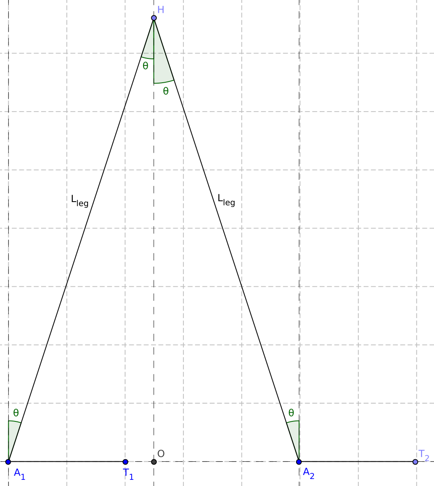
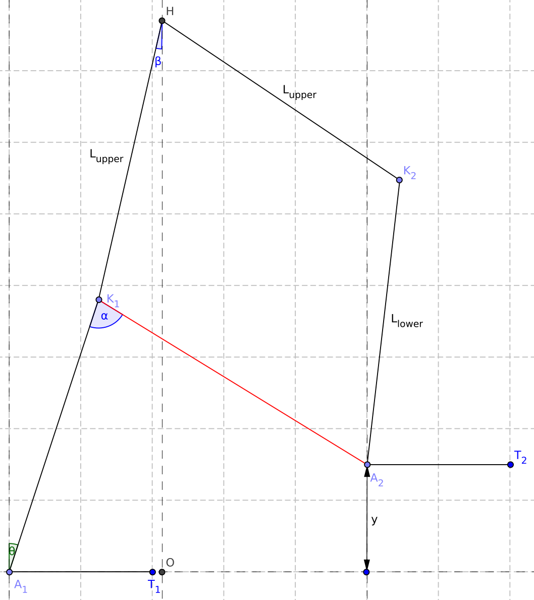
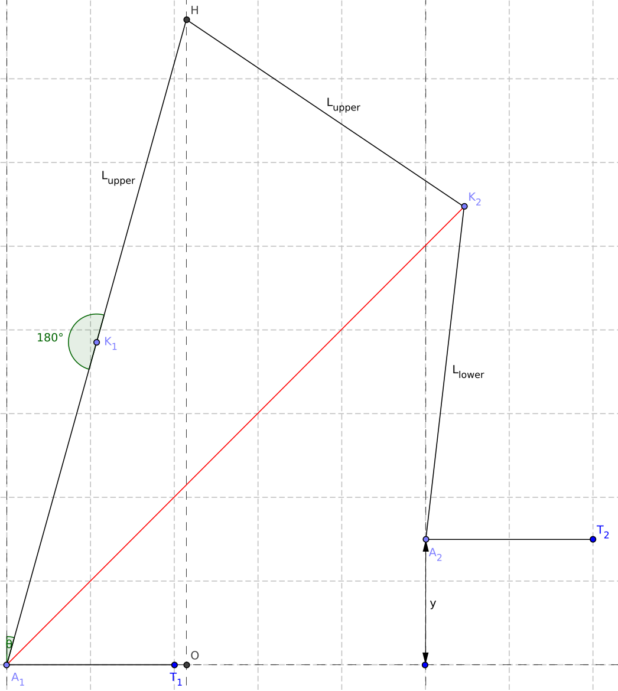
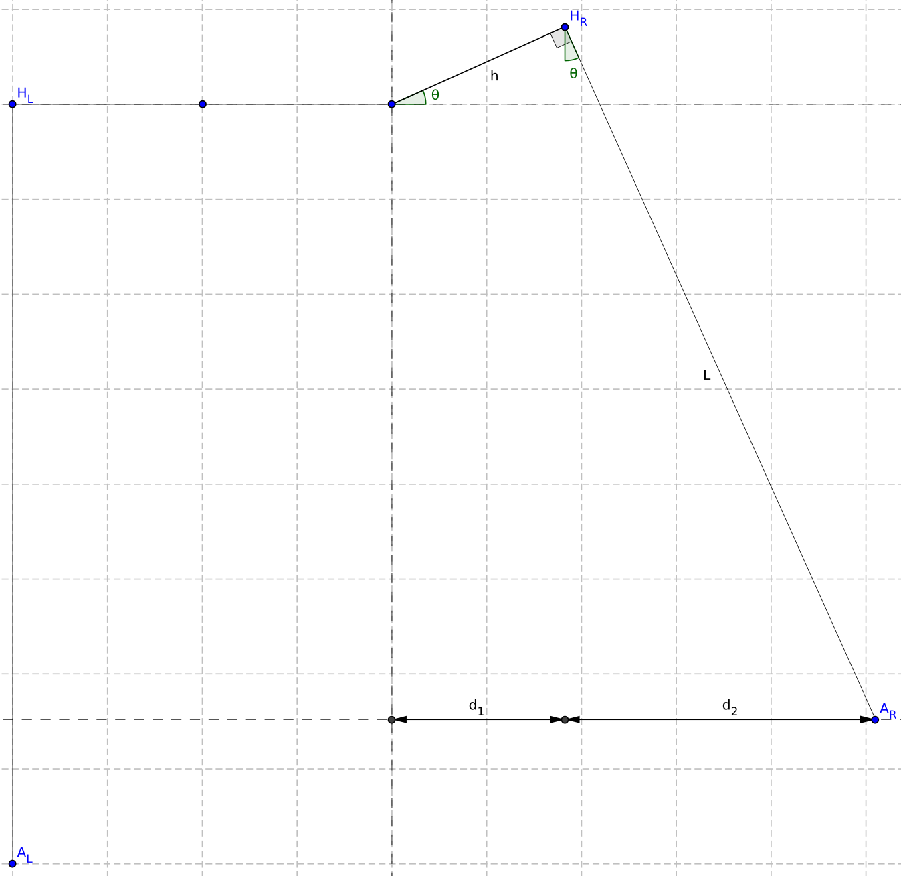

# Documentation: March Goniometric Inverse Kinematic Solver

## Introduction

<table><tr><td width=50%>

This file provides the documentation of the Inverse Kinematic (IK) solver, used for dynamic gaits. For the use of the IK solver, a Pose class is made, containing the pose of the exo by specifying the joint angles of all joints. The Pose class contains two important methods, namely to find the end-pose  and the mid-pose to reach a given foot location. The mathematics used to find these end- and mid-pose are described step-wise, in the same order as used in [ik_solver.py](march_goniometric_ik_solver/ik_solver.py):

1. [Calculate ground pose flexion](#calculate-ground-pose-flexion)
2. [Calculate lifted pose](#calculate-lifted-pose)
3. [Reduce swing dorsi flexion](#reduce-swing-dorsi-flexion)
4. [Straighten leg](#straighten-leg)

</td><td width=50%>

[PLACEHOLDER IMAGE]

</td></tr></table>


## Calculate ground pose flexion

<table><tr><td width=50%>

The `solve_end_position()` method expects the x, y and z location of the desired place for the foot, defined as:

x: step size distance between two feet\
y: height of the foot, relative to the other\
z: side step distance, where z = 0 with hip_AA = 0.

For this first step of the IK solver, only the x position is used. A equilateral triangle is formed and the angles of the ankles and hip, required to reach this x position is determined using pythagoras theorem:

```math
\begin{align*}
x &= 2 \sin(\theta) \cdot L_{leg}\\
\theta &= \arcsin \left( \frac{x}{2L_{leg}} \right)
\end{align*}
```

Because of definition, this results in:

```math
\begin{align*}
\text{fe}_{ankle1} &= \text{fe}_{hip2} = \theta\\
\text{fe}_{ankle2} &= \text{fe}_{hip1} = -\theta\\
\end{align*}
```

</td><td width=50%>



</td></tr></table>


## Calculate lifted pose

<table><tr><td width=50%>

The second step is applying the given y location. Currently, only a positive y-value is expected. The $`\text{fe}_{ankle1}`$, $`\text{fe}_{knee1}`$ and $`\text{fe}_{hip1}`$ do not change, which results in fixing the rear leg. We can calculate the distance between the hip $`(H)`$ and the desired location of ankle2 $`(A_2)`$. Furthermore, the distances between the hip $`(H)`$ and knee2 $`(K_2)`$ and between knee2 $`(K_2)`$ and ankle2 $`(A_2)`$ are known as the lengths of the upper leg $`(L_{upper})`$ and the lower leg $`(L_{lower})`$. This results in a triangle of which all side lengths are known, meaning that we can also calculate all three angles $`(\angle_{hip}, \angle_{knee2}, \angle_{ankle2})`$.

Besides those three angles, we also need $`\angle O H A_2`$ and $`\angle H A_2 T_2`$. Now we can define the new joint angles as:

```math
\begin{align*}
\text{fe}_{hip2} &= \angle O H A_2 + \angle_{hip}\\
\text{fe}_{knee2} &= \text{KNEE\_ZERO\_ANGLE} - \angle_{knee2}\\
\text{fe}_{ankle2} &= \text{ANKLE\_ZERO\_ANGLE} - (\angle H A_2 T_2 - \angle_{ankle2})
\end{align*}
```

</td><td width=50%>


</td></tr></table>

## Reduce swing dorsi flexion

<table><tr><td width=50%>

After raising the foot to the desired location in the previous step, the dorsi-flexion limit of ankle2 might been exceeded. Therefore, we need to reduce the dorsi-flexion. We first calculate the required reduction as:

$`\text{reduction} = \text{fe}_{ankle2} - \text{MAX\_FLEXION}`$

Next, we can form the quadrilateral between $`H, K_2, A_2, K_1`$, with angles $`\angle_{hip}, \angle_{knee2}, \angle_{ankle2}, \angle_{knee2}`$. We can calculate the value of $`\angle_{ankle2}`$ before reducing the dorsi-flexion. We also know the value we would like after reducing the dorsi_flexion:

$`\angle_{ankle2} = \angle_{ankle2,BEFORE} - \text{reduction}`$

We know the lengths of all sides of the formed quadrilateral and now also the value of one angle $`(\angle_{ankle2})`$, which means that we can calculate the other three angles of the quadrilateral. There are two possible solutions, depending on whether the quadrilateral should be convex or concave. In this case, we want to have a convex quadrilateral. 

After calculating the other three angles of the quadrilateral, we can first define the new joint value of knee1. Therefore we also need $`\angle A_1 K_1 A_2`$, whereafter we can say:

```math
\begin{align*}
\text{fe}_{knee2} &= \angle_{knee1} + \angle A_1 K_1 A_2 - \text{KNEE\_ZERO\_ANGLE}
\end{align*}
```

Next, we can determine the new locations of knee1 $`(K_1)`$, hip $`(H)`$ and a point below the hip $`(O)`$. The angle between these points $`(\angle K_1 H O)`$ is the new fe-value of hip1. This value is negative for $`x_{K1} < x_H`$ and positive for $`x_{K1} > x_H`$ by definition, resulting in:

```math
\begin{align*}
\text{fe}_{hip1} &= \text{sign}(x_{K1} - x_H) \angle K_1 H O
\end{align*}
```

Finally, we can define the other changed joint values as:

```math
\begin{align*}
\text{fe}_{hip2} &= \angle_{hip} + \text{fe}_{hip1}\\
\text{fe}_{knee2} &= \text{KNEE\_ZERO\_ANGLE} - \angle_{knee2}\\
\text{fe}_{ankle2} &= \text{fe}_{ankle2,BEFORE} - \text{reduction}
\end{align*}
```

</td><td width=50%>



</td></tr></table>

## Straighten leg

<table><tr><td width=50%>

Reducing the dorsi-flexion of the swing leg in the previous step results in a bended knee of the rear leg. The higher the reduction was, the more knee1 is now bended. In this step we will straighten the rear leg again. After straightening we can define the triangle between the points $`A_1, K_2, H`$, with angles $`\angle_{ankle1}, \angle_{knee2}, \angle_{hip}`$. Since the locations of $`A_1`$ and $`K_2`$ do not change during this step, we know the lengths of all sides of the defined triangle, which means we can also calculate all angles.

Next, we can define the new joint values of ankle1 and knee1. To do this, we also need $`\angle T_1 A_1 K_2`$. We can define:

```math
\begin{align*}
\text{fe}_{ankle1} &= \text{ANKLE\_ZERO\_ANGLE} - (\angle_{ankle1} + \angle T_1 A_1 K_2)\\
\text{fe}_{knee1} &= 0
\end{align*}
```

Next, we can determine the new locations of knee1 $`(K_1)`$, hip $`(H)`$ and a point below the hip $`(O)`$. The angle between these points $`(\angle K_1 H O)`$, in the image defined as $`\beta`$ is the new fe-value of hip1. This value is negative for $`x_{K1} < x_H`$ and positive for $`x_{K1} > x_H`$ by definition, resulting in:

```math
\begin{align*}
\text{fe}_{hip1} &= \text{sign}(x_{K1} - x_H) \angle K_1 H O
\end{align*}
```

Finally, we can define the other changed joint values. To do this, we also need $`\angle A_1 K_2 A_2`$:

```math
\begin{align*}
\text{fe}_{hip2} &= \angle_{hip} + \text{fe}_{hip1}\\
\text{fe}_{knee2} &= \text{KNEE\_ZERO\_ANGLE} - (\angle_{knee2} + \angle A_1 K_2 A_2)\\
\end{align*}
```

</td><td width=50%>



</td></tr></table>

## Side Step
<!--  -->

<table><tr><td width=50%> 

To make a side step of size $`S`$, we can apply an equal amount of hip adduction on both sides, so that both feet contribute to the side step with a distance of $`z = S/2`$. We define $`z`$ as the horizontal place we would like to place the foot, with $`z = 0`$ for $`\theta = 0`$. This results in a distance of $`d_1 + d_2 = z + h`$.

We can express $`d_1 = \cos(\theta)h`$ and $`d_2 = \sqrt{L^2 - \cos(\theta)^2L^2}`$, resulting in the equation:

```math
\cos(\theta)h + \sqrt{L^2 - \cos(\theta)^2L^2} = z + h
```

This can be rewritten with the following steps:

```math
\begin{align*}
L^2 - \cos(\theta)^2 L^2 &= ((z + h) - \cos(\theta)h)^2 \\
L^2 - \cos(\theta)^2 L^2 &= (z + h)^2 - \cos(\theta)(2z+2h^2) + \cos(\theta)^2 h^2 \\
\cos(\theta)^2 (h^2 + L^2) - \cos(\theta)(2z+2h^2) &= L^2 - (z + h)^2
\end{align*}
```

Substitution of $`\cos(\theta) = A`$ and rewriting gives:

```math
\begin{align*}
A^2 - A\frac{2z+2h^2}{h^2 + L^2} &= \frac{L^2 - (z + h)^2}{h^2 + L^2} \\
\left(A - \frac{z+h^2}{h^2 + L^2}\right)^2 - \left(\frac{z+h^2}{h^2 + L^2}\right)^2 &= \frac{L^2 - (z + h)^2}{h^2 + L^2} \\
A &= \frac{z+h^2}{h^2 + L^2} \pm \sqrt{\frac{L^2 - (z + h)^2}{h^2 + L^2} + \left(\frac{z+h^2}{h^2 + L^2}\right)^2}
\end{align*}
```

We are interested in the positive solution, resulting in:

```math
\begin{align*}
\theta &= \arccos \left( \frac{z+h^2}{h^2 + L^2} + \sqrt{\frac{L^2 - (z + h)^2}{h^2 + L^2} + \left(\frac{z+h^2}{h^2 + L^2}\right)^2} \right)
\end{align*}
```

</td><td width=50%>



</td></tr></table>