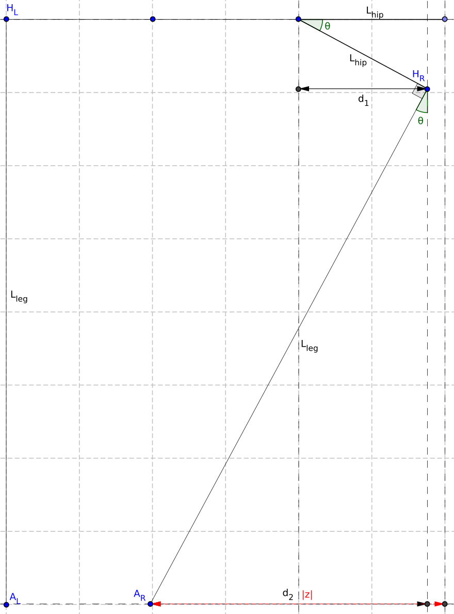

# Documentation: March Goniometric Inverse Kinematic Solver
1. [Side Step](#side-step)

## Side Step
<!--  -->

<table><tr><td width=50%> 

To make a side step of size $`S`$, we can apply an equal amount of hip adduction on both sides, so that both feet contribute to the side step with a distance of $`z = S/2`$. We define $`z`$ as the horizontal place we would like to place the foot, with $`z = 0`$ for $`\theta = 0`$. This results in a distance of $`d_1 + d_2 = z + h`$.

We can express $`d_1 = \cos(\theta)h`$ and $`d_2 = \sqrt{L^2 - \cos(\theta)^2L^2}`$, resulting in the equation:

```math
\cos(\theta)h + \sqrt{L^2 - \cos(\theta)^2L^2} = z + h
```

This can be rewritten with the following steps:

```math
\begin{align*}
L^2 - \cos(\theta)^2 L^2 &= ((z + h) - \cos(\theta)h)^2 \\
L^2 - \cos(\theta)^2 L^2 &= (z + h)^2 - \cos(\theta)(2z+2h^2) + \cos(\theta)^2 h^2 \\
\cos(\theta)^2 (h^2 + L^2) - \cos(\theta)(2z+2h^2) &= L^2 - (z + h)^2
\end{align*}
```

Substitution of $`\cos(\theta) = A`$ and rewriting gives:

```math
\begin{align*}
A^2 - A\frac{2z+2h^2}{h^2 + L^2} &= \frac{L^2 - (z + h)^2}{h^2 + L^2} \\
\left(A - \frac{z+h^2}{h^2 + L^2}\right)^2 - \left(\frac{z+h^2}{h^2 + L^2}\right)^2 &= \frac{L^2 - (z + h)^2}{h^2 + L^2} \\
A &= \frac{z+h^2}{h^2 + L^2} \pm \sqrt{\frac{L^2 - (z + h)^2}{h^2 + L^2} + \left(\frac{z+h^2}{h^2 + L^2}\right)^2}
\end{align*}
```

We are interested in the positive solution, resulting in:

```math
\begin{align*}
\theta &= \arccos \left( \frac{z+h^2}{h^2 + L^2} + \sqrt{\frac{L^2 - (z + h)^2}{h^2 + L^2} + \left(\frac{z+h^2}{h^2 + L^2}\right)^2} \right)
\end{align*}
```

</td><td width=50%>



</td></tr></table>