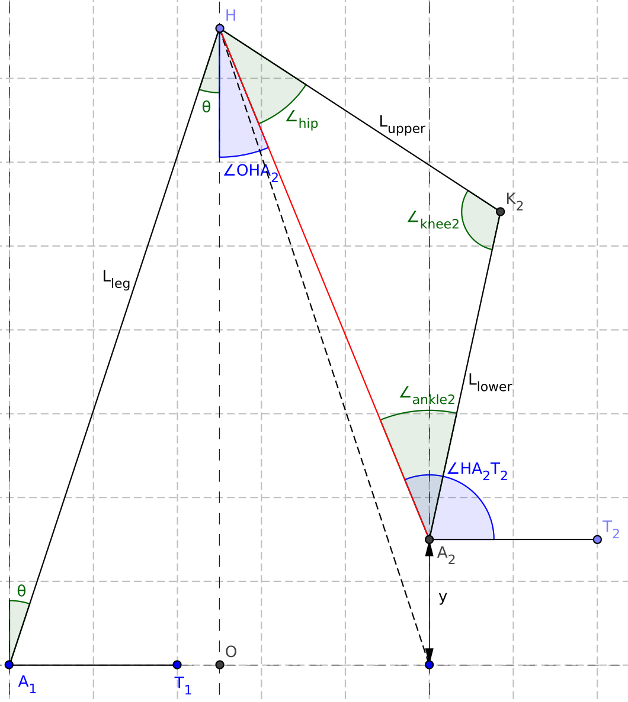
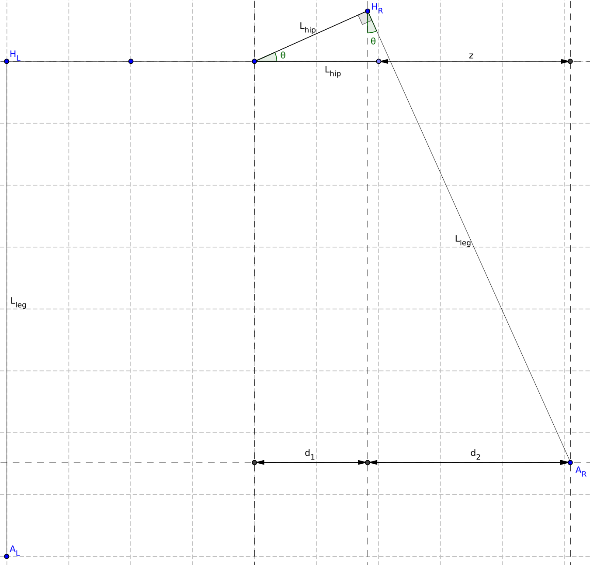

# Documentation: March Goniometric Inverse Kinematic Solver

## Introduction

<table><tr><td width=50%>

This file provides the documentation of the Inverse Kinematic (IK) solver, used for dynamic gaits. For the use of the IK solver, a Pose class is made, containing the pose of the exo by specifying the joint angles of all joints. The Pose class contains two important methods, namely to find the end-pose  and the mid-pose to reach a given foot location. The mathematics used to find these end- and mid-pose are described step-wise, in the same order as used in [ik_solver.py](march_goniometric_ik_solver/ik_solver.py):

1. [Calculate ground pose flexion](#calculate-ground-pose-flexion)
2. [Calculate lifted pose](#calculate-lifted-pose)
3. [Reduce swing dorsi flexion](#reduce-swing-dorsi-flexion)

</td><td width=50%>

[PLACEHOLDER IMAGE]

</td></tr></table>


## Calculate ground pose flexion

<table><tr><td width=50%>

The `solve_end_position()` method expects the x, y and z location of the desired place for the foot, defined as:

x: step size distance between two feet\
y: height of the foot, relative to the other\
z: side step distance, where z = 0 with hip_AA = 0.

For this first step of the IK solver, only the x position is used. A equilateral triangle is formed and the angles of the ankles and hip, required to reach this x position is determined using pythagoras theorem:

```math
\begin{align*}
x &= 2 \sin(\theta) \cdot L_{leg}\\
\theta &= \arcsin \left( \frac{x}{2L_{leg}} \right)
\end{align*}
```

Because of definition, this results in:

```math
\begin{align*}
\text{fe}_{ankle1} &= \text{fe}_{hip2} = \theta\\
\text{fe}_{ankle2} &= \text{fe}_{hip1} = -\theta\\
\end{align*}
```

</td><td width=50%>


</td></tr></table>


## Calculate lifted pose

<table><tr><td width=50%>

The second step is applying the given y location. Currently, only a positive y-value is expected. The $\text{fe}_{ankle1}$, $\text{fe}_{knee1}$ and $\text{fe}_{hip1}$ do not change, which results in fixing the rear leg. We can calculate the distance between the hip $(H)$ and the desired location of ankle2 $(A_2)$. Furthermore, the distances between the hip $(H)$ and knee2 $(K_2)$ and between knee2 $(K_2)$ and ankle2 $(A_2)$ are known as the lengths of the upper leg $(L_{upper})$ and the lower leg $(L_{lower})$. This results in a triangle of which all side lengths are known, meaning that we can also calculate all three angles $(\angle_{hip}, \angle_{knee2}, \angle_{ankle2})$.

Besides those three angles, we also need $\angle O H A_2$ and $\angle H A_2 T_2$, in the picture defined as $\alpha$ and $\beta$. Now we can define the new joint angles as:

```math
\begin{align*}
\text{fe}_{hip2} &= \alpha + \angle_{hip}\\
\text{fe}_{knee2} &= 180 \degree - \angle_{knee2}\\
\text{fe}_{ankle2} &= 90 \degree - (\beta - \angle_{ankle2})
\end{align*}
```

</td><td width=50%>



</td></tr></table>

## Reduce swing dorsi flexion

<table><tr><td width=50%>

PLACEHOLDER TEXT

</td><td width=50%>

[PLACEHOLDER IMAGE]

</td></tr></table>

## Side Step
<!--  -->

<table><tr><td width=50%> 

To make a side step of size $`S`$, we can apply an equal amount of hip adduction on both sides, so that both feet contribute to the side step with a distance of $`z = S/2`$. We define $`z`$ as the horizontal place we would like to place the foot, with $`z = 0`$ for $`\theta = 0`$. This results in a distance of $`d_1 + d_2 = z + h`$.

We can express $`d_1 = \cos(\theta)h`$ and $`d_2 = \sqrt{L^2 - \cos(\theta)^2L^2}`$, resulting in the equation:

```math
\cos(\theta)h + \sqrt{L^2 - \cos(\theta)^2L^2} = z + h
```

This can be rewritten with the following steps:

```math
\begin{align*}
L^2 - \cos(\theta)^2 L^2 &= ((z + h) - \cos(\theta)h)^2 \\
L^2 - \cos(\theta)^2 L^2 &= (z + h)^2 - \cos(\theta)(2z+2h^2) + \cos(\theta)^2 h^2 \\
\cos(\theta)^2 (h^2 + L^2) - \cos(\theta)(2z+2h^2) &= L^2 - (z + h)^2
\end{align*}
```

Substitution of $`\cos(\theta) = A`$ and rewriting gives:

```math
\begin{align*}
A^2 - A\frac{2z+2h^2}{h^2 + L^2} &= \frac{L^2 - (z + h)^2}{h^2 + L^2} \\
\left(A - \frac{z+h^2}{h^2 + L^2}\right)^2 - \left(\frac{z+h^2}{h^2 + L^2}\right)^2 &= \frac{L^2 - (z + h)^2}{h^2 + L^2} \\
A &= \frac{z+h^2}{h^2 + L^2} \pm \sqrt{\frac{L^2 - (z + h)^2}{h^2 + L^2} + \left(\frac{z+h^2}{h^2 + L^2}\right)^2}
\end{align*}
```

We are interested in the positive solution, resulting in:

```math
\begin{align*}
\theta &= \arccos \left( \frac{z+h^2}{h^2 + L^2} + \sqrt{\frac{L^2 - (z + h)^2}{h^2 + L^2} + \left(\frac{z+h^2}{h^2 + L^2}\right)^2} \right)
\end{align*}
```

</td><td width=50%>



</td></tr></table>