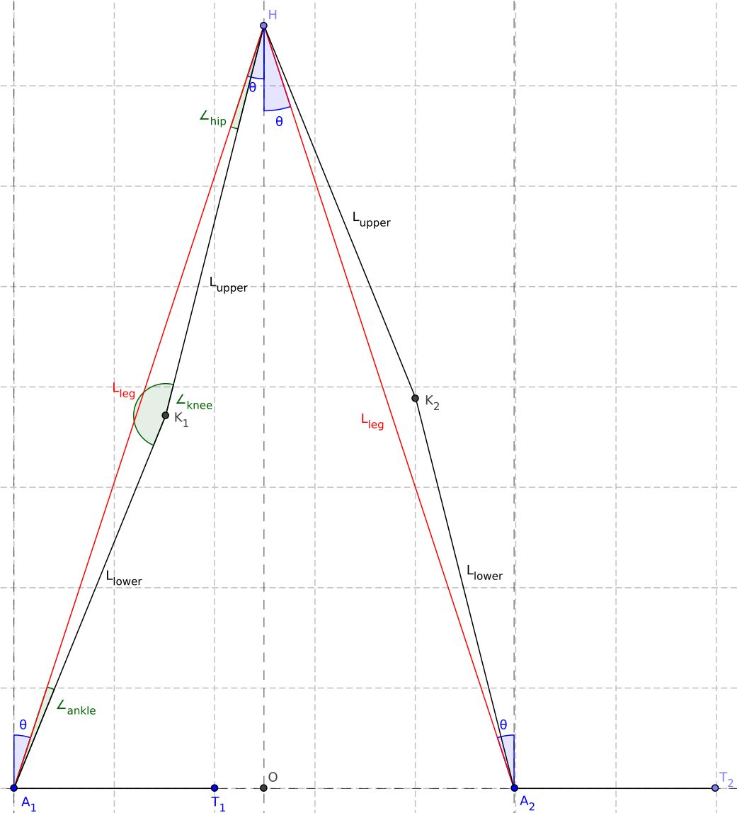
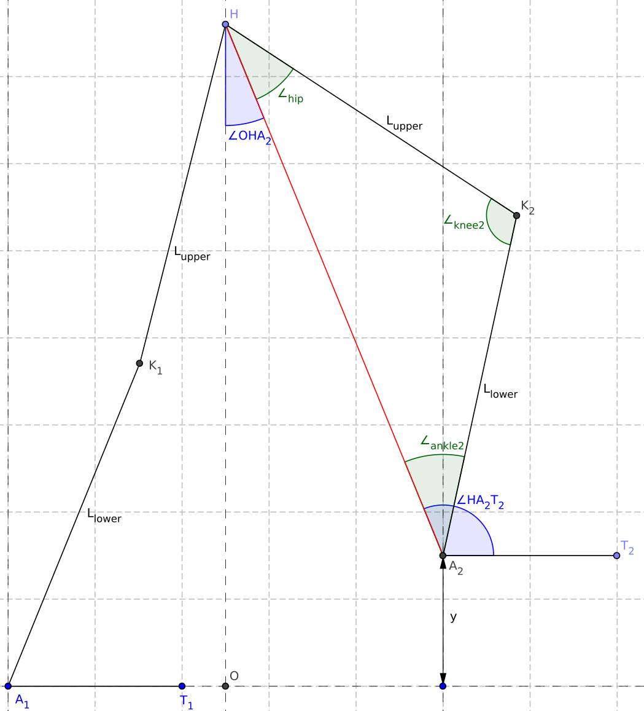
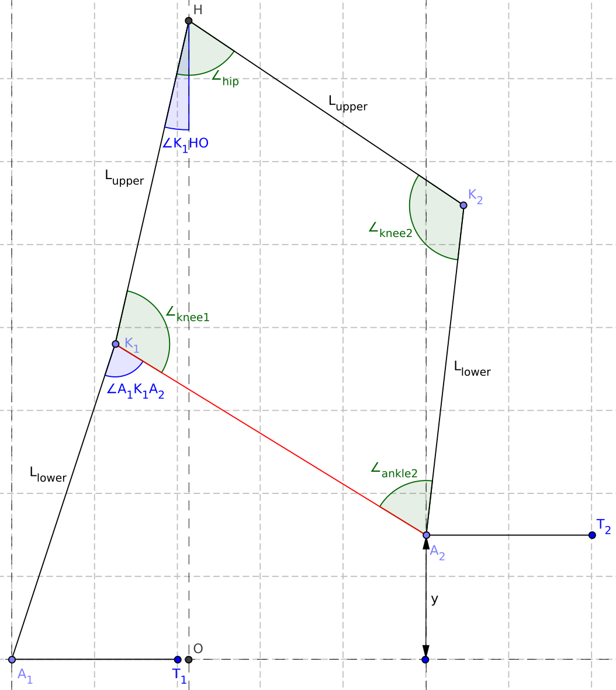
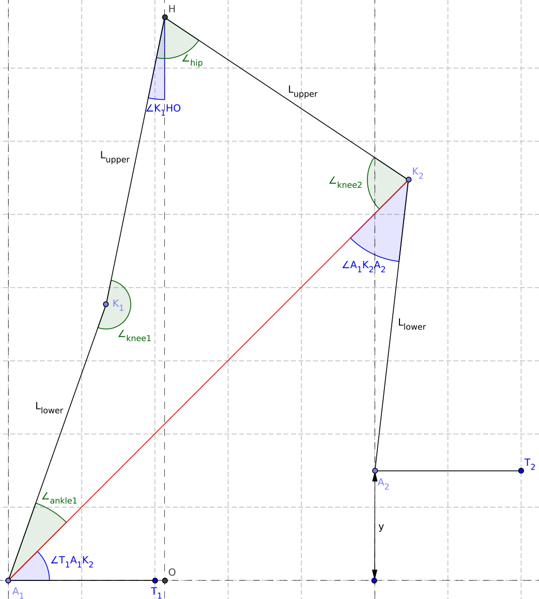
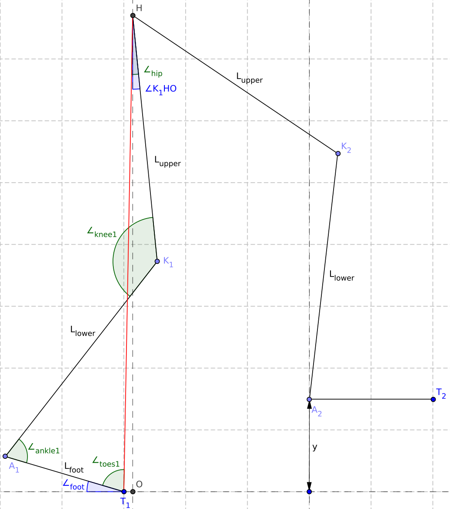
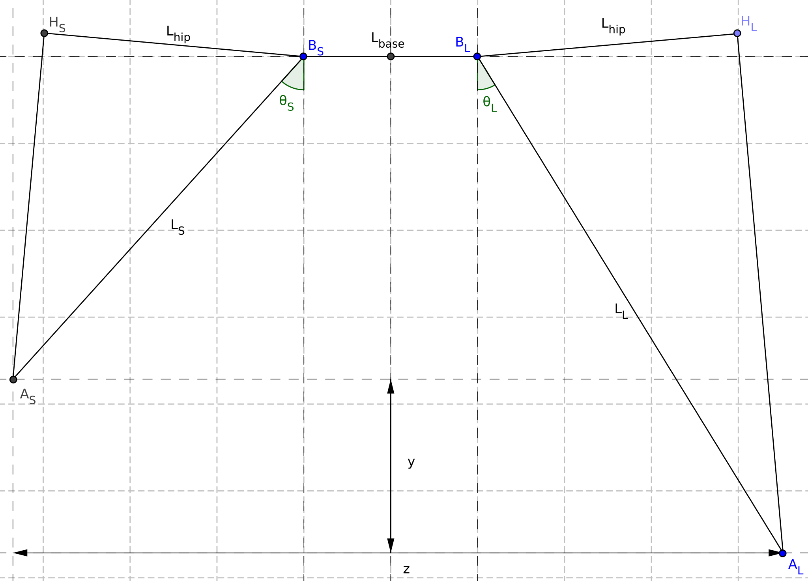

# Documentation: March Goniometric Inverse Kinematic Solver

## Introduction

<table><tr><td width=50%>

This file provides the documentation of the Inverse Kinematic (IK) solver, used for dynamic gaits. For the use of the IK solver, a Pose class is made, containing the pose of the exo by specifying the joint angles of all joints.

We use the following definitions:

| Variable:             | Positive:     | Negative:       |
| --------------------- | ------------- | --------------- |
| $`\text{fe}_{ankle}`$ | dorsi_flexion | plantar-flexion |
| $`\text{fe}_{knee}`$  | flexion       | extension       |
| $`\text{fe}_{hip}`$   | flexion       | extension       |
| $`\text{aa}_{hip}`$   | abduction     | adduction       |

Since it should not matter whether the leg in front is the left or right leg, we use the definition of 1 or 2 after the variables in the table, where 1 is a joint in the rear leg and 2 a joint in the front leg.

Furthermore we define $`\text{ANKLE\_ZERO\_ANLE} = 90 \degree`$ and $`\text{KNEE\_ZERO\_ANGLE = 180 \degree}`$, since $`\text{fe}_{ankle} = 0`$ results in an angle between foot and lower leg of 90 degrees and $`\text{fe}_{knee} = 0`$ results in an angle between lower leg and upper leg of 180 degrees.

The Pose class contains two important methods, namely to find the end-pose  and the mid-pose to reach a given foot location. The mathematics used to find these end- and mid-pose are described step-wise, in the same order as used in [ik_solver.py](march_goniometric_ik_solver/ik_solver.py):

[Calculate ground pose flexion](#calculate-ground-pose-flexion)\
[Calculate lifted pose](#calculate-lifted-pose)\
[Reduce swing dorsi flexion](#reduce-swing-dorsi-flexion)\
[Straighten leg](#straighten-leg)\
[Reduce stance dorsi flexion](#reduce-stance-dorsi-flexion)\
[Side step](#side-step)

</td><td width=50%>

</td></tr></table>


## Calculate ground pose flexion

<table><tr><td width=50%>

The `solve_end_position()` method expects the x, y and z location of the desired place for the foot, defined as:

x: step size distance between two feet\
y: height of the foot, relative to the other\
z: the distance between the two feet

For this first step of the IK solver, only the x position is used. Furthermore we use a desired knee bending, so that the exo never reaches complete straight legs. We first calculate the distance between ankle and hip with the desired knee bending $`(L_{leg})`$. 

Next, a equilateral triangle is formed with two sides of the calculated length $`L_{leg}`$ and the angle $`\theta`$ formed at the ankles and hip, required to reach this x position is determined using pythagoras theorem:

```math
\begin{align*}
x &= 2 \sin(\theta) \cdot L_{leg}\\
\theta &= \arcsin \left( \frac{x}{2L_{leg}} \right)
\end{align*}
```

With the angles $`\angle_{ankle}, \angle_{knee}, \angle_{hip}`$, we can define the joint values as:

```math
\begin{align*}
\text{fe}_{knee11} &= \text{fe}_{knee2} = \text{DEFAULT\_KNEE\_BEND}\\
\text{fe}_{ankle1} &= \theta + \angle_{ankle}\\
\text{fe}_{hip1} &=  -\theta + \angle_{hip} \\
\text{fe}_{hip2} &= \theta + \angle_{hip}\\
\text{fe}_{ankle2} &= -\theta + \angle_{ankle}\\
\end{align*}
```

</td><td width=50%>



</td></tr></table>


## Calculate lifted pose

<table><tr><td width=50%>

The second step is applying the given y location. Currently, only a positive y-value is expected. The $`\text{fe}_{ankle1}`$, $`\text{fe}_{knee1}`$ and $`\text{fe}_{hip1}`$ do not change, which results in fixing the rear leg. We can calculate the distance between the hip $`(H)`$ and the desired location of ankle2 $`(A_2)`$. Furthermore, the distances between the hip $`(H)`$ and knee2 $`(K_2)`$ and between knee2 $`(K_2)`$ and ankle2 $`(A_2)`$ are known as the lengths of the upper leg $`(L_{upper})`$ and the lower leg $`(L_{lower})`$. This results in a triangle of which all side lengths are known, meaning that we can also calculate all three angles $`(\angle_{hip}, \angle_{knee2}, \angle_{ankle2})`$.

Besides those three angles, we also need $`\angle O H A_2`$ and $`\angle H A_2 T_2`$. Now we can define the new joint angles as:

```math
\begin{align*}
\text{fe}_{hip2} &= \angle O H A_2 + \angle_{hip}\\
\text{fe}_{knee2} &= \text{KNEE\_ZERO\_ANGLE} - \angle_{knee2}\\
\text{fe}_{ankle2} &= \text{ANKLE\_ZERO\_ANGLE} - (\angle H A_2 T_2 - \angle_{ankle2})
\end{align*}
```

</td><td width=50%>



</td></tr></table>

## Reduce swing dorsi flexion

<table><tr><td width=50%>

After raising the foot to the desired location in the previous step, the dorsi-flexion limit of ankle2 might been exceeded. Therefore, we need to reduce the dorsi-flexion. We first calculate the required reduction as:

$`\text{reduction} = \text{fe}_{ankle2} - \text{MAX\_FLEXION}`$

Next, we can form the quadrilateral between $`H, K_2, A_2, K_1`$, with angles $`\angle_{hip}, \angle_{knee2}, \angle_{ankle2}, \angle_{knee2}`$. We can calculate the value of $`\angle_{ankle2}`$ before reducing the dorsi-flexion. We also know the value we would like after reducing the dorsi_flexion:

$`\angle_{ankle2} = \angle_{ankle2,BEFORE} - \text{reduction}`$

We know the lengths of all sides of the formed quadrilateral and now also the value of one angle $`(\angle_{ankle2})`$, which means that we can calculate the other three angles of the quadrilateral. There are two possible solutions, depending on whether the quadrilateral should be convex or concave. In this case, we want to have a convex quadrilateral. 

After calculating the other three angles of the quadrilateral, we can first define the new joint value of knee1. Therefore we also need $`\angle A_1 K_1 A_2`$, whereafter we can say:

```math
\begin{align*}
\text{fe}_{knee2} &= \angle_{knee1} + \angle A_1 K_1 A_2 - \text{KNEE\_ZERO\_ANGLE}
\end{align*}
```

Next, we can determine the new locations of knee1 $`(K_1)`$, hip $`(H)`$ and a point below the hip $`(O)`$. The angle between these points $`(\angle K_1 H O)`$ is the new fe-value of hip1. This value is negative for $`x_{K1} < x_H`$ and positive for $`x_{K1} > x_H`$ by definition, resulting in:

```math
\begin{align*}
\text{fe}_{hip1} &= \text{sign}(x_{K1} - x_H) \angle K_1 H O
\end{align*}
```

Finally, we can define the other changed joint values as:

```math
\begin{align*}
\text{fe}_{hip2} &= \angle_{hip} + \text{fe}_{hip1}\\
\text{fe}_{knee2} &= \text{KNEE\_ZERO\_ANGLE} - \angle_{knee2}\\
\text{fe}_{ankle2} &= \text{fe}_{ankle2,BEFORE} - \text{reduction}
\end{align*}
```

</td><td width=50%>



</td></tr></table>

## Straighten leg

<table><tr><td width=50%>

Reducing the dorsi-flexion of the swing leg in the previous step results in a bended knee of the rear leg. The higher the reduction was, the more knee1 is now bended. In this step we will straighten the rear leg again. We can define the quadrilateral between the points $`A_1, K_2, H, K_1`$, with angles $`\angle_{ankle1}, \angle_{knee2}, \angle_{hip}, \angle_{knee1}`$. We know the lengths of all sides of the defined quadrilateral and we know the desired angle of knee1, which means we can also calculate all angles.

Next, we can define the new joint values of ankle1 and knee1. To do this, we also need $`\angle T_1 A_1 K_2`$. We can define:

```math
\begin{align*}
\text{fe}_{ankle1} &= \text{ANKLE\_ZERO\_ANGLE} - (\angle_{ankle1} + \angle T_1 A_1 K_2)\\
\text{fe}_{knee1} &= \text{DEFAULT\_KNEE\_BEND}
\end{align*}
```

Next, we can determine the new locations of knee1 $`(K_1)`$, hip $`(H)`$ and a point below the hip $`(O)`$. The angle between these points $`(\angle K_1 H O)`$, in the image defined as $`\beta`$ is the new fe-value of hip1. This value is negative for $`x_{K1} < x_H`$ and positive for $`x_{K1} > x_H`$ by definition, resulting in:

```math
\begin{align*}
\text{fe}_{hip1} &= \text{sign}(x_{K1} - x_H) \angle K_1 H O
\end{align*}
```

Finally, we can define the other changed joint values. To do this, we also need $`\angle A_1 K_2 A_2`$:

```math
\begin{align*}
\text{fe}_{hip2} &= \angle_{hip} + \text{fe}_{hip1}\\
\text{fe}_{knee2} &= \text{KNEE\_ZERO\_ANGLE} - (\angle_{knee2} + \angle A_1 K_2 A_2)\\
\end{align*}
```

</td><td width=50%>



</td></tr></table>

## Reduce stance dorsi flexion

<table><tr><td width=50%>

Finally, we need to check the dorsi-flexion of ankle1, since the limit could be exceeded. If the limit is exceeded, we can form a quadrilateral between points $`T_1, A_1, K_1, H`$. We can rotate the rear foot and bend knee1 until the dorsi-flexion is within the limits again. Since we know the length of all sides of the quadrilateral and the required angle $`\angle_{ankle1}`$, we can calculate the other three angles. Note that in this case we want to have the concave solution. After calculating $`\angle_{toes1}, \angle_{knee1} \angle_{hip}`$, we can define the new joint values of ankle1 and knee1:

```math
\begin{align*}
\text{fe}_{ankle1} &= \text{ANKLE\_ZERO\_ANGLE} - \angle_{ankle1}\\
\text{fe}_{knee1} &= \text{KNEE\_ZERO\_ANGLE} - \angle_{knee1}\\
\end{align*}
```

With these new values, we can determine the new location of knee2 $`(K_2)`$. The location of the hip $`(H)`$ and the point below the hip $`(O)`$ did not change. The angle between these points $`(\angle K_1 H O)`$ is the new fe-value of hip1. This value is negative for $`x_{K1} < x_H`$ and positive for $`x_{K1} > x_H`$ by definition, resulting in:

```math
\begin{align*}
\text{fe}_{hip1} &= \text{sign}(x_{K1} - x_H) \angle K_1 H O
\end{align*}
```

Although it is not required for the exoskeleton pose, we can also calculate the rotation of the rear foot relative to the ground as the difference of $`\angle_{toes1}`$ before and after reducing the dorsi-flexion: $`\angle_{foot} = \angle_{toes1,AFTER}-\angle_{toes1,BEFORE}`$. 

</td><td width=50%>



</td></tr></table>


## Side step

<table><tr><td width=50% style="table-layout:fixed;">

So far, we ignored the z-value given to the solver, but now we will derive the equations for this dimension. We want to know the required hip_aa of both hips to have a distance $`|z|`$ between the two feet. Note that it is important that the vertical distance between the two feet $`(y)`$ must remain the same.  This is quit a complex mathematical problem, therefore we use python's Sympy to solve it.

To solve this problem, we calculate with the distance between the hip base and the ankles. We have $`L_S`$ as the distance of the 'short leg' (the leg that is most bended and thus has the highest foot) and we have $`L_L`$ as the distance of the 'long leg' (the leg that is bended least and thus has the lowest foot). We can define the two conditions we want to fulfill:

```math
\begin{align}
z &= \sin(\theta_S)L_S + L_{base} + \sin(\theta_L)L_L\\
y &= \cos(\theta_L)L_L - \cos(\theta_S)L_S
\end{align}
```

We can isolate $`\theta_L`$ from (1), giving two possible solutions:

```math
\begin{align}
\theta_L &= \operatorname{asin}{\left(\frac{L_{S} \sin{\left(\theta_{S} \right)} + L_{base} - z}{L_{L}} \right)} + \pi\\
\theta_L &= - \operatorname{asin}{\left(\frac{L_{S} \sin{\left(\theta_{S} \right)} + L_{base} - z}{L_{L}} \right)}
\end{align}
```

We can also isolate $`\theta_S`$ from (2), also giving two possible solutions:


```math
\begin{align}
\theta_S &= - \operatorname{acos}{\left(\frac{L_{L} \cos{\left(\theta_{L} \right)} - y}{L_{S}} \right)} + 2 \pi\\
\theta_S &= \operatorname{acos}{\left(\frac{L_{L} \cos{\left(\theta_{L} \right)} - y}{L_{S}} \right)}
\end{align}
```

We can substitute a expression of $`\theta_S`$, (5) or (6), in one of the two expressions of $`\theta_L`$, (3) or (4). This gives 4 possible equations, depending on the combination we choose. If we rewrite one of those 4 possible equations to isolate $`z`$, we end up with two different possible expressions:

```math
\begin{align}
z = L_{L} \sin{\left(\theta_{L} \right)} \pm L_{S} \sqrt{\frac{- L_{L}^{2} \cos^{2}{\left(\theta_{L} \right)} + 2 L_{L} y \cos{\left(\theta_{L} \right)} + L_{S}^{2} - y^{2}}{L_{S}^{2}}} + L_{base}
\end{align}
```

Finally, we can isolate $`\theta_L`$ in one of the two equations of (7). This is a very complex operation, which took Sympy more than 5 minutes per result on a fast laptop. In the end it will find two unique solutions, independent of the used expression for $`z`$:

<details>
<summary>
Click to expand very long equation
</summary>

```math
\begin{align*}
\theta_L = 2 \operatorname{atan}{\left(\frac{- 2 L_{L} L_{base} + 2 L_{L} z \pm \sqrt{- L_{L}^{4} + 2 L_{L}^{2} L_{S}^{2} + 2 L_{L}^{2} L_{base}^{2} - 4 L_{L}^{2} L_{base} z + 2 L_{L}^{2} y^{2} + 2 L_{L}^{2} z^{2} - L_{S}^{4} + 2 L_{S}^{2} L_{base}^{2} - 4 L_{S}^{2} L_{base} z + 2 L_{S}^{2} y^{2} + 2 L_{S}^{2} z^{2} - L_{base}^{4} + 4 L_{base}^{3} z - 2 L_{base}^{2} y^{2} - 6 L_{base}^{2} z^{2} + 4 L_{base} y^{2} z + 4 L_{base} z^{3} - y^{4} - 2 y^{2} z^{2} - z^{4}}}{L_{L}^{2} + 2 L_{L} y - L_{S}^{2} + L_{base}^{2} - 2 L_{base} z + y^{2} + z^{2}} \right)}
\end{align*}
```

</details>
<br>

A simple try shows that we are interested in the equation with the minus sign. The found equations is valid for both outwards and inwards side steps. Another try shows that we need equation (6) to calculate $`\theta_S`$. Finally, we simply add $`\angle ABH`$ for the 'short' or 'long' side to get the required hip_aa's.

</td><td width=50%>



</td></tr></table>

<!--

### outwards

<table><tr><td width=50%> 

So far, we ignored the z-value given to the solver, but know we will derive the equations for this dimension. To make a side step of size $`S`$, we can apply an equal amount of hip adduction on both sides, so that both feet contribute to the side step with a distance of $`z = S/2`$. We define $`z`$ as the horizontal place we would like to place the foot, with $`z = 0`$ for $`\theta = 0`$. This results in a distance of $`d_1 + d_2 = z + h`$.

We can express $`d_1 = \cos(\theta)h`$ and $`d_2 = \sqrt{L^2 - \cos(\theta)^2L^2}`$, resulting in the equation:

```math
\begin{align*}
\cos(\theta)h + \sqrt{L^2 - \cos(\theta)^2L^2} = z + h
\end{align*}
```

This can be rewritten with the following steps:

```math
\begin{align*}
L^2 - \cos(\theta)^2 L^2 &= ((z + h) - \cos(\theta)h)^2 \\
L^2 - \cos(\theta)^2 L^2 &= (z + h)^2 - \cos(\theta)(2z+2h^2) + \cos(\theta)^2 h^2 \\
\cos(\theta)^2 (h^2 + L^2) - \cos(\theta)(2z+2h^2) &= L^2 - (z + h)^2
\end{align*}
```

Substitution of $`\cos(\theta) = A`$ and rewriting gives:

```math
\begin{align*}
A^2 - A\frac{2z+2h^2}{h^2 + L^2} &= \frac{L^2 - (z + h)^2}{h^2 + L^2} \\
\left(A - \frac{z+h^2}{h^2 + L^2}\right)^2 - \left(\frac{z+h^2}{h^2 + L^2}\right)^2 &= \frac{L^2 - (z + h)^2}{h^2 + L^2} \\
A &= \frac{z+h^2}{h^2 + L^2} \pm \sqrt{\frac{L^2 - (z + h)^2}{h^2 + L^2} + \left(\frac{z+h^2}{h^2 + L^2}\right)^2}
\end{align*}
```

We are interested in the positive solution, resulting in:

```math
\begin{align*}
\theta &= \arccos \left( \frac{z+h^2}{h^2 + L^2} + \sqrt{\frac{L^2 - (z + h)^2}{h^2 + L^2} + \left(\frac{z+h^2}{h^2 + L^2}\right)^2} \right)
\end{align*}
```

</td><td width=50%>


</td></tr></table>

### inwards

<table><tr><td width=50%> 

To make a side step inwards, we again apply an equal amount of hip adduction on both sides, so that both feet contribute to the side step with a distance of $`z = S/2`$. We still define $`z`$ as the horizontal place we would like to place the foot, with $`z = 0`$ for $`\theta = 0`$. Notice that $`S`$ and $`z`$ will be negative value for an inwards step. This now results in $`z = -h + d_1 - d_2`$, which can be rewritten as $`d_1 - d_2 = z + h`$.

We can again express $`d_1 = \cos(\theta)h`$ and $`d_2 = \sqrt{L^2 - \cos(\theta)^2L^2}`$, resulting in the equation:

```math
\begin{align*}
\cos(\theta)h - \sqrt{L^2 - \cos(\theta)^2L^2} = z + h
\end{align*}
```

This can be rewritten with the following steps:

```math
\begin{align*}
L^2 - \cos(\theta)^2 L^2 &= (-(z + h) - \cos(\theta)h)^2\\
L^2 - \cos(\theta)^2 L^2 &= (z + h)^2 - \cos(\theta)(2z+2h^2) + \cos(\theta)^2 h^2\\
\cos(\theta)^2 (h^2 + L^2) - \cos(\theta)(2z+2h^2) &= L^2 - (z + h)^2
\end{align*}
```

Notice that this is equal to the result we had for an outwards step, before substituting. Therefore we know the solution for an inwards step will also be the same as for an outwards step. The only difference is that $\theta$ will be negative by our definition that hip abduction is positive and hip adduction is negative. Therefore we can give the general solution as:

```math
\begin{align*}
\theta &= \text{sign}(z) \arccos \left( \frac{z+h^2}{h^2 + L^2} + \sqrt{\frac{L^2 - (z + h)^2}{h^2 + L^2} + \left(\frac{z+h^2}{h^2 + L^2}\right)^2} \right)
\end{align*}
```

</td><td width=50%>


</td></tr></table>

 -->


 </body>